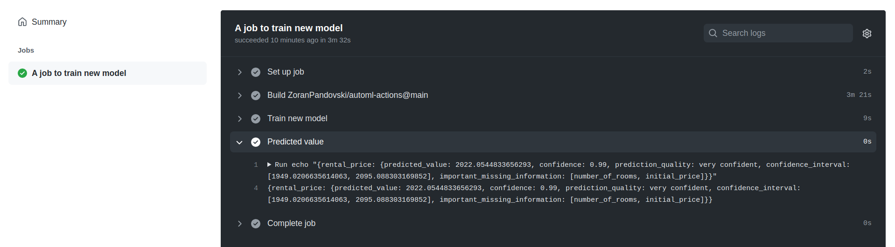

# AutoML GitHub Action

>**Easly do data analysis, train new model and get the prediction as an output using :bear:MindsDB:bear: inside GitHub Actions.**

## Usage

Inside your workflow.yml file add:

```yaml
job_name:
  runs-on: ubuntu-latest
  name: A job to train new model
  steps:
  - name: Train new model
    id: train
    uses: ZoranPandovski/automl-actions@main
    with:
      dataset: "home_rentals.csv"
      target: "price"
      when: "{sqft: 500, rooms: 5}"
```

### :factory: Inputs :ship:

| Name 	| Required 	| Description 	|  
|-	|-	|-	|
|  **dataset** :books: 	| Yes 	| The path or URL to data. Can be path to the data file inside the repository or any public acessible URL as path to s3 file, raw github file, public JSON API etc. 	|
| **target** :pushpin: 	| Yes 	| The name of the variable that needs to be predicted. 	| 
| **when** :scroll:	| Yes 	| The data that you want to make a prediction for e.g {"key" : "value", "key": "value"} 	|
| **stop_training** :alarm_clock:| No 	| Stop model training after X seconds. 	|

### :carousel_horse: Outputs :ferris_wheel:

| Name 	| Description 	|  	  	
|-	|-	|
| **prediction** :chart_with_upwards_trend: 	| The predicted value 	|  	

An example output that displays the predicted value, confidence and confidence interval.



### :construction_worker:  :construction:  Roadmap :construction_worker:  :construction: 

- [X] :loudspeaker: **v1.0.0**
    * POC
    * Accept input as dataset, target variable, query.
    * Return prediction as output.
- [ ] :tractor: **v2.0.0**
    * Add option for batch prediction using data in repo file or public accesible data.
    * Add option for data analysis as output.
    * Accept timeseries parameters as input e.g order_by, group_by.
- [ ] :truck: **v3.0.0**
    * Add option to upload a model to s3, GitHub repo, azure blob storage etc.

### :checkered_flag: :warning: Disclaimer :checkered_flag: :warning:
> :vertical_traffic_light: For the GitHub Actions usage and billing check out the [GitHub Site Policy](https://docs.github.com/en/github/site-policy/github-additional-product-terms#5-actions-and-packages).
